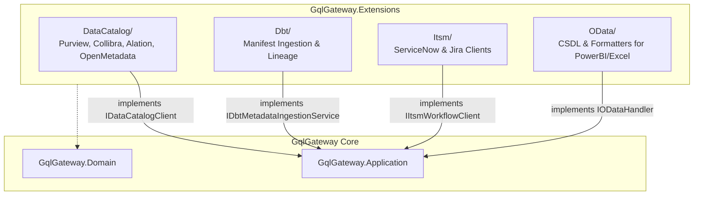

# GqlGateway Extensions Architecture Overview

Dieses Dokument beschreibt die Architektur, Schichtentrennung und Integrationsmuster des Repositories `GqlGateway.Extensions`.

---

## 1. Architektur-Ziele & Entkopplung

`GqlGateway.Extensions` stellt optionale Enterprise-Konnektoren, Third-Party-Adapter und Integrationsdienste für das Core-Gateway bereit.

### Leitprinzipien
1. **Zero Coupling to Core Hosting**: Extensions implementieren reine Application-Interfaces aus `GqlGateway.Application` und `GqlGateway.Domain`. Sie binden sich nicht transitiv an den ASP.NET Core Kestrel-Host oder HotChocolate-Execution-Engine des Core-Gateways.
2. **Pluggable Registration**: Die Registrierung erfolgt über eine einzige Erweiterungsmethode:
   ```csharp
   services.AddGatewayExtensions(gatewayOptions, hostEnvironment);
   ```
3. **Resilient Outbound I/O**: Sämtliche HTTP-basierten Clients (`MicrosoftPurviewCatalogClient`, `CollibraCatalogClient`, `AlationCatalogClient`, `ServiceNowClient`, `JiraClient`, `OpenMetadataClient`) nutzen `IHttpClientFactory` mit `SocketsHttpHandler` (Connection Pooling, DNS-Refresh, Circuit Breaking).
4. **Zero-Trust & Governance-Konformität**: Sensitivitätsklassifizierungen aus Drittsystemen werden strikt validiert. Bei Erkennung von DSGVO Art. 9 Daten (Gesundheit, Biometrie, Ethnie, Glaube, Gewerkschaft) erzwingen die Adapter automatische Redaction und Vier-Augen-Freigabe.

---

## 2. Modul-Übersicht



### Komponenten-Matrix

| Modul | Hauptklassen / Services | Core-Schnittstellen | Anwendungsfall |
| :--- | :--- | :--- | :--- |
| **DataCatalog** | [`DataCatalogSyncService`](file:///root/gql_extensions/src/GqlGateway.Extensions/DataCatalog/DataCatalogSyncService.cs)<br/>[`MicrosoftPurviewCatalogClient`](file:///root/gql_extensions/src/GqlGateway.Extensions/DataCatalog/MicrosoftPurviewCatalogClient.cs)<br/>[`CollibraCatalogClient`](file:///root/gql_extensions/src/GqlGateway.Extensions/DataCatalog/CollibraCatalogClient.cs)<br/>[`AlationCatalogClient`](file:///root/gql_extensions/src/GqlGateway.Extensions/DataCatalog/AlationCatalogClient.cs)<br/>[`OpenMetadataCatalogAdapter`](file:///root/gql_extensions/src/GqlGateway.Extensions/DataCatalog/OpenMetadataCatalogAdapter.cs) | `IDataCatalogClient`<br/>`IDataCatalogSyncService` | Bidirektionaler Sync oder Realtime-Lookup von Tabellen- und Spalten-Metadaten, DSGVO-Tags und Eigentümern. |
| **Dbt** | [`DbtMetadataIngestionService`](file:///root/gql_extensions/src/GqlGateway.Extensions/Dbt/DbtMetadataIngestionService.cs)<br/>[`DbtArtifactStreamingParser`](file:///root/gql_extensions/src/GqlGateway.Extensions/Dbt/DbtArtifactStreamingParser.cs)<br/>[`DbtExposurePublisher`](file:///root/gql_extensions/src/GqlGateway.Extensions/Dbt/DbtExposurePublisher.cs) | `IDbtMetadataIngestionService`<br/>`IDbtExposurePublisher` | Automatisierte Ingestion von dbt `manifest.json` / `catalog.json` zur Generierung von Data Lineage & Schema-Attributen. |
| **Itsm** | [`ServiceNowClient`](file:///root/gql_extensions/src/GqlGateway.Extensions/Itsm/ServiceNowClient.cs)<br/>[`JiraClient`](file:///root/gql_extensions/src/GqlGateway.Extensions/Itsm/JiraClient.cs) | `IItsmWorkflowClient` | Erzeugung von Genehmigungs-Tickets für sensible Datenabfragen und Vier-Augen-Prozesse. |
| **OData** | [`ODataHandler`](file:///root/gql_extensions/src/GqlGateway.Extensions/OData/ODataHandler.cs)<br/>[`ODataCsdlGenerator`](file:///root/gql_extensions/src/GqlGateway.Extensions/OData/ODataCsdlGenerator.cs)<br/>[`ODataResponseFormatter`](file:///root/gql_extensions/src/GqlGateway.Extensions/OData/ODataResponseFormatter.cs) | `IODataHandler` | Bereitstellung eines standardisierten OData v4 Endpunkts für Power BI, Microsoft Excel und SAP-Systeme. |

---

## 3. Dependency Injection & Lebenszyklen

Die Abhängigkeiten werden in [`ExtensionsServiceCollectionExtensions.cs`](file:///root/gql_extensions/src/GqlGateway.Extensions/ExtensionsServiceCollectionExtensions.cs) konfiguriert:

- **HTTP-Clients**: Werden über Typed Clients mit Scoped/Transient-Lebensdauer registriert; `HttpMessageHandler` wird durch die Factory verwaltet (keine Socket-Erschöpfung).
- **Sync Services**: Werden als `Scoped` instanziiert, um per-Request oder per-Job State Isolation zu garantieren.
- **Hosted Services**: 
  - `OpenMetadataSyncBackgroundService`: Läuft zyklisch im Hintergrund, falls `OpenMetadata.Enabled == true`.
  - `DataCatalogSyncBackgroundService`: Läuft zyklisch im Hintergrund, falls `Catalog.Enabled == true`.

---

## 4. Sicherheit & Insecure Modes

In Dev- und Sandbox-Umgebungen können externe Testinstanzen selbstsignierte TLS-Zertifikate verwenden. Hierfür stehen die standardisierten Präfixe zur Verfügung:
- `warn_allow_self_signed_certs`: Akzeptiert nicht-vertrauenswürdige TLS-Zertifikate in Nicht-Produktionsumgebungen.
- `danger_bypass_catalog_auth`: Überspringt Bearer-Token-Header (nur für lokale Mock-Server).
- In Produktion (`environment.IsProduction()`) blockiert das Gateway den Start, wenn `danger_`-Optionen aktiviert sind.
