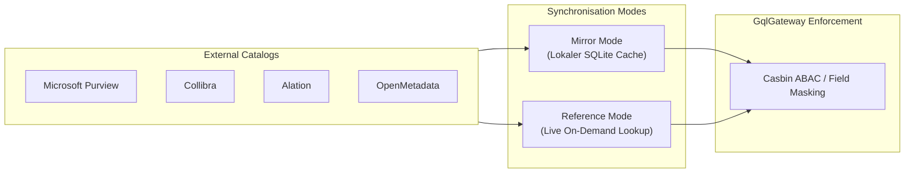

# Enterprise Data Catalog Integration Guide

Dieser Leitfaden beschreibt die Anbindung externer Data-Catalog-Systeme an das **GqlGateway** über die `GqlGateway.Extensions`.

---

## 1. Übersicht & Betriebsmodi

Das Modul `DataCatalog` synchronisiert Metadaten, Eigentümer, Glossar-Begriffe und Sensitivitäts-Klassifizierungen aus führenden Enterprise-Katalogen.

Es werden zwei primäre Betriebsmodi unterstützt:



1. **Mirror Mode (`SyncMode: Mirror`)**:
   - Die Metadaten werden periodisch über Hintergrunddienste ([`DataCatalogSyncBackgroundService`](file:///root/gql_extensions/src/GqlGateway.Extensions/DataCatalog/DataCatalogSyncBackgroundService.cs)) in den lokalen Governance-Store (SQLite) synchronisiert.
   - **Vorteil**: Extrem niedrige Latenz im Query-Pfad (< 0.2 ms), da keine externen I/O-Aufrufe während der GraphQL-Ausführung stattfinden. Hohe Ausfallsicherheit bei Ausfällen des Katalogs.
2. **Reference Mode (`SyncMode: Reference`)**:
   - Das Gateway cached Metadaten im L1/L2-Cache und fragt bei Cache-Misses die Daten live über den jeweiligen Catalog-Client ab.
   - **Vorteil**: Sofortige Verfügbarkeit von Schema-Änderungen und Klassifizierungs-Updates ohne Batch-Wartezeiten.

---

## 2. Unterstützte Kataloge & Konfiguration

Die Konfiguration erfolgt in `appsettings.json` unter dem Knoten `GatewayOptions:Catalog`:

```json
{
  "GatewayOptions": {
    "Catalog": {
      "Enabled": true,
      "Provider": "Purview", // "Purview" | "Collibra" | "Alation" | "OpenMetadata"
      "SyncMode": "Mirror",   // "Mirror" | "Reference"
      "SyncIntervalMinutes": 30,
      "Purview": {
        "Endpoint": "https://corp-purview.purview.azure.com",
        "TenantId": "00000000-0000-0000-0000-000000000000",
        "ClientId": "11111111-1111-1111-1111-111111111111",
        "ClientSecret": "${PURVIEW_CLIENT_SECRET}"
      },
      "Collibra": {
        "BaseUrl": "https://corp.collibra.com/rest/2.0",
        "Username": "svc-gql-gateway",
        "Password": "${COLLIBRA_PASSWORD}"
      },
      "Alation": {
        "BaseUrl": "https://alation.corp.internal",
        "ApiToken": "${ALATION_API_TOKEN}"
      },
      "OpenMetadata": {
        "BaseUrl": "http://openmetadata:8585/api",
        "JwtToken": "${OPENMETADATA_JWT}"
      },
      "InsecureFlags": {
        "warn_allow_self_signed_certs": false,
        "danger_bypass_catalog_auth": false
      }
    }
  }
}
```

---

## 3. Automatisches DSGVO Art. 9 Tag-Mapping

Kataloge markieren sensible Spalten häufig mit standardisierten oder proprietären Tags. Die Extension mappt diese Tags deterministisch auf Schutzrichtlinien:

| Catalog-Tag / Klassifizierung | Gateway-Sensitivität | Maskierungs-Aktion | Zusätzliche Richtlinie |
| :--- | :--- | :--- | :--- |
| `PII.Email`, `EmailAddress` | `MEDIUM` | `MASK_EMAIL` (`u***@domain.com`) | ABAC Policy Check |
| `PII.IBAN`, `Financial.AccountNumber` | `HIGH` | `MASK_LAST_FOUR` (`**** **** **** 1234`) | Audit-Log Mandatory |
| `GDPR.Art9.Health`, `HealthRecord` | `CRITICAL` | `REDACT` (`[REDACTED-GDPR-ART9]`) | **RequiresFourEyes = true** |
| `GDPR.Art9.Biometric`, `Fingerprint` | `CRITICAL` | `REDACT` (`[REDACTED-GDPR-ART9]`) | **RequiresFourEyes = true** |
| `GDPR.Art9.Religion`, `PoliticalBelief` | `CRITICAL` | `REDACT` (`[REDACTED-GDPR-ART9]`) | **RequiresFourEyes = true** |
| `Security.PasswordHash`, `Secret` | `CRITICAL` | `DROP_COLUMN` | Blockiert Query / Schema Exclusion |

---

## 4. Testen & Lokale Verifikation

Die Extension-Tests enthalten vollständige Mocks und WireMock-Szenarien für alle Kataloge:

```bash
# Ausführung aller Data-Catalog-Integrationstests
dotnet test GqlExtensions.slnx --filter "FullyQualifiedName~DataCatalog"
```
