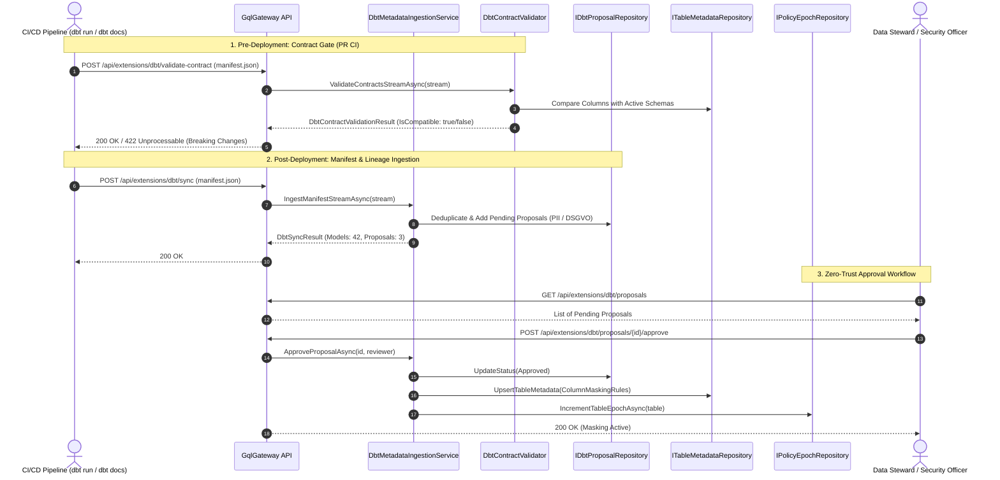

# dbt (data build tool) Enterprise Integration Guide

Dieser Leitfaden beschreibt die End-to-End-Integration von **dbt Core / dbt Cloud** in das **GqlGateway** über die `GqlGateway.Extensions`.

---

## 1. Übersicht & Enterprise-Architektur

Moderne Data-Mesh- und Analytics-Teams nutzen dbt für Transformationen, Datenqualitätsprüfungen (`dbt test`) und Schemaverträge (`contract: { enforced: true }`).

Das Modul `Dbt` schlägt die Brücke zwischen Data Engineering und GraphQL-API-Governance:
1. **Streaming Ingestion von `manifest.json`**: Modelle, Seeds, Spaltentypen, DSGVO-Tags und Abhängigkeiten fließen direkt in den [`LineageGraphStore`](file:///root/gql/src/GqlGateway.Application/Interfaces/ILineageGraphStore.cs).
2. **Zero-Trust Proposal & Freigabe-Workflow**: Erkannte PII- und DSGVO-Attribute werden nicht ungeprüft aktiv, sondern erzeugen [`DbtMetadataProposal`](file:///root/gql/src/GqlGateway.Domain/Model/DbtMetadataModels.cs)-Einträge (`PendingReview`). Nach 4-Augen-Freigabe werden Maskierungsregeln im [`ITableMetadataRepository`](file:///root/gql/src/GqlGateway.Application/Interfaces/IGovernanceRepository.cs) aktiviert und die Policy-Epoche invalidiert.
3. **CI/CD Breaking-Change Contract Enforcement**: Der [`DbtContractValidator`](file:///root/gql_extensions/src/GqlGateway.Extensions/Dbt/DbtContractValidator.cs) gleicht neue dbt-Manifeste im Pull-Request-CI gegen aktive GraphQL-Schemata ab und verhindert Breaking Changes (entfernte Pflichtfelder, Typ-Inkompatibilitäten).
4. **Bidirektionale Exposures**: Der [`DbtExposurePublisher`](file:///root/gql_extensions/src/GqlGateway.Extensions/Dbt/DbtExposurePublisher.cs) meldet aktive GraphQL-Entitäten und Konsumenten als `exposures.yaml` an dbt zurück.

---

## 2. End-to-End Governance & Ingestion-Workflow



---

## 3. REST-Endpunkte Referenz

Alle dbt-Endpunkte erfordern Authentifizierung (`.RequireAuthorization()`):

| Endpunkt | Methode | Beschreibung |
| :--- | :---: | :--- |
| `/api/extensions/dbt/sync` | `POST` | Ingestion des dbt `manifest.json`. Unterstützt Query-Parameter `?dryRun=true`. Max. 100 MB. |
| `/api/extensions/dbt/validate-contract` | `POST` | Prüft dbt Model Contracts (`contract.enforced: true`) gegen aktive Tabellenschemata auf Breaking Changes. |
| `/api/extensions/dbt/proposals` | `GET` | Listet ausstehende Governance-Vorschläge (`PendingReview`). Optional gefiltert nach `?database=X&schema=Y&table=Z`. |
| `/api/extensions/dbt/proposals/{id}/approve` | `POST` | Genehmigt einen PII-Maskierungsvorschlag, aktualisiert `TableMetadata` und invalidiert die Policy-Epoche. |
| `/api/extensions/dbt/proposals/{id}/reject` | `POST` | Weist einen vorgeschlagenen Governance-Eintrag ab. |
| `/api/extensions/dbt/exposures` | `GET` | Generiert ein valides `exposures.yaml` zur Rückführung aktiver GraphQL-Abhängigkeiten in dbt Docs. |

---

## 4. dbt Model Contract Enforcement (`contract: { enforced: true }`)

Wenn ein dbt-Modell mit erzwungenem Vertrag definiert ist:

```yaml
version: 2
models:
  - name: stg_customers
    config:
      materialized: view
    contract:
      enforced: true
    columns:
      - name: customer_id
        data_type: integer
      - name: email_address
        data_type: varchar
```

Prüft der [`DbtContractValidator`](file:///root/gql_extensions/src/GqlGateway.Extensions/Dbt/DbtContractValidator.cs):
1. **Entfernte Spalten (`DROPPED_COLUMN`)**: Wurde eine Spalte gelöscht, die in aktiven GraphQL-Clients abgefragt wird?
2. **Datentyp-Mismatches (`DATA_TYPE_MISMATCH`)**: Wurde ein Typ inkompatibel geändert (z. B. `integer` zu `varchar`), der Serialisierer oder Client-Typen bricht?

Rückgabe bei Inkompatibilität (HTTP 422):
```json
{
  "isCompatible": false,
  "validatedModelsCount": 1,
  "breakingChanges": [
    {
      "table": "postgres.raw.stg_customers",
      "columnName": "phone_number",
      "changeType": "DROPPED_COLUMN",
      "existingType": "varchar",
      "proposedType": null,
      "description": "Column 'phone_number' was removed from enforced contract model 'stg_customers', but exists in active gateway schema."
    }
  ],
  "warnings": []
}
```

---

## 5. Streaming Ingestion & Performance

Da dbt-Manifeste in großen Projekten Hunderte Megabytes groß sein können, liest [`DbtArtifactStreamingParser`](file:///root/gql_extensions/src/GqlGateway.Extensions/Dbt/DbtArtifactStreamingParser.cs) den Stream asynchron mit konfigurierbarer Tiefen- und Kommentar-Toleranz (`JsonDocumentOptions.MaxDepth = 64`, `CommentHandling = Skip`).

- **Selektive Node-Filterung**: Verarbeitet ausschließlich `model.*`- und `seed.*`-Knoten; Makros, Tests und Operationen werden im Lesepfad übersprungen.
- **Deduplizierung**: Mehrfache Ingestion-Läufe (z. B. nach jedem nächtlichen Build) führen dank Deduplizierungsprüfung nicht zu redundanten Vorschlägen für dieselbe Spalte.

---

## 6. Lokale Tests & Verifikation

```bash
# Unit-Tests der dbt Extensions ausführen
dotnet test GqlExtensions.slnx --filter "FullyQualifiedName~Dbt"

# End-to-End Integrationstests (Sync, Approval, Contract Check)
dotnet test GqlGateway.sln --filter "FullyQualifiedName~DbtIntegrationTests"
```
