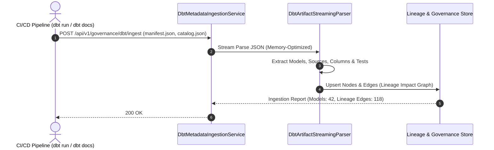

# dbt (data build tool) Integration Guide

Dieser Leitfaden beschreibt die Ingestion von dbt-Metadaten und Lineage-Graphen über die `GqlGateway.Extensions`.

---

## 1. Übersicht & Zielsetzung

Moderne Data-Teams nutzen dbt für die Transformation und Modellierung von Daten im Data Warehouse (Snowflake, BigQuery, Databricks, PostgreSQL). 

Das Modul `Dbt` ermöglicht:
1. **Automatisierte Schema- & Dokumentations-Ingestion**: dbt-Beschreibungen, Tests und Spaltentypen werden direkt in das GraphQL-Schema und die Metadaten-Schicht übernommen.
2. **Data Lineage Synchronization**: Die Abhängigkeiten zwischen dbt-Modellen, Quellen (Sources) und Downstream-Exposures fließen in den Lineage-Store des Gateways ein.
3. **Continuous Governance in CI/CD**: Beim Deployment einer dbt-Pipeline wird das erzeugte `manifest.json` via Webhook oder CLI an das Gateway übermittelt.

---

## 2. Ingestion-Workflow



---

## 3. Streaming Parser & Performance

Da dbt-Manifeste in Enterprise-Umgebungen Hunderte Megabytes groß werden können, nutzt [`DbtArtifactStreamingParser`](file:///root/gql_extensions/src/GqlGateway.Extensions/Dbt/DbtArtifactStreamingParser.cs) `System.Text.Json.Utf8JsonReader` für Zero-Buffer Streaming:

- **Keine DOM-Allokation**: Es wird kein monolithisches `JsonDocument` im Heap gehalten.
- **Node-Filterung**: Nur relevante Knoten (`model`, `source`, `exposure`) und Spalten-Attribute (`meta`, `tags`) werden selektiv ausgelesen.
- **DSGVO-Tags in dbt `meta`**:
  ```yaml
  version: 2
  models:
    - name: customers
      description: "Kern-Kundendaten"
      columns:
        - name: email
          description: "Kunden E-Mail"
          meta:
            sensitivity: MEDIUM
            masking: MASK_EMAIL
        - name: health_survey_result
          description: "Gesundheitsdaten"
          meta:
            sensitivity: CRITICAL
            gdpr_art9: true
  ```
  Diese `meta`-Tags werden automatisch in Gateway-Maskierungsregeln übersetzt.

---

## 4. dbt Exposure Publishing

Mit dem [`DbtExposurePublisher`](file:///root/gql_extensions/src/GqlGateway.Extensions/Dbt/DbtExposurePublisher.cs) kann das Gateway automatisch seine GraphQL-Queries als Exposures in dbt zurückmelden:
- Dadurch sehen Data-Engineers in dbt Docs und Lineage DAGs, welche GraphQL-Entitäten und Clients von Modell-Änderungen betroffen sind.
- Ermöglicht Impact-Analysen bereits vor dem Ausführen destruktiver Migrationen (`dbt run --full-refresh`).
