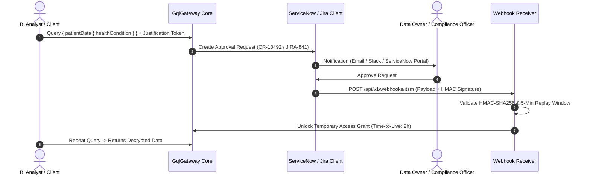

# ITSM Approval & Webhook Integration Guide

Dieser Leitfaden beschreibt die Anbindung von **ServiceNow** und **Jira Service Management** für Justification- und Vier-Augen-Freigabe-Workflows.

---

## 1. Architektur des Genehmigungsworkflows

Wenn ein API-Client auf hochsensible Daten zugreifen möchte (z. B. DSGVO Art. 9 Daten oder Spalten mit `RequiresFourEyes = true`), fordert das Gateway eine geschäftliche Begründung (Justification) oder eine externe Ticket-Genehmigung an.



---

## 2. Webhook-Sicherheit & Kryptographische Härtung

### HMAC-SHA256 Signaturprüfung
Alle eingehenden Webhooks von ServiceNow oder Jira müssen kryptographisch signiert sein:
- **Header**: `X-Hub-Signature-256: sha256=<hex_hash>` oder `X-ServiceNow-Signature`.
- **Timing-Safe Comparison**: Die Verifikation erfolgt via `CryptographicOperations.FixedTimeEquals` zur vollständigen Verhinderung von Timing-Side-Channel-Angriffen.

### Replay-Schutz
- Jeder Request muss einen Timestamp-Header enthalten (`X-Webhook-Timestamp`).
- Weicht der Timestamp um mehr als 300 Sekunden (5 Minuten) von der Serverzeit ab, wird der Request mit HTTP 401 abgelehnt.
- Nonces oder Ticket-IDs werden im Cache entwertet, um doppelte Verarbeitung zu verhindern.

### Insecure Flags für Entwickler
In lokalen Entwicklungsumgebungen oder isolierten CI/CD-Pipelines:
- `warn_skip_replay_check`: Deaktiviert die 5-Minuten-Zeitfenster-Prüfung (z. B. beim Debuggen mit Postman).
- `danger_skip_webhook_hmac`: Deaktiviert die Signatur-Prüfung (nur außerhalb von Produktion zulässig; blockiert Start in Production).

---

## 3. Konfiguration

```json
{
  "GatewayOptions": {
    "Itsm": {
      "Provider": "ServiceNow", // "ServiceNow" | "Jira"
      "ServiceNowBaseUrl": "https://company.service-now.com",
      "ServiceNowApiKey": "${SERVICENOW_API_KEY}",
      "JiraBaseUrl": "https://company.atlassian.net",
      "JiraApiToken": "${JIRA_API_TOKEN}",
      "WebhookSecret": "${ITSM_WEBHOOK_HMAC_SECRET}",
      "InsecureFlags": {
        "warn_skip_replay_check": false,
        "danger_skip_webhook_hmac": false
      }
    }
  }
}
```
