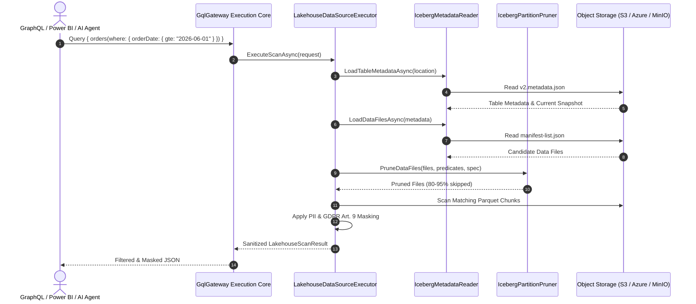

# Apache Iceberg & Modern Lakehouse Connector Guide

Dieser Leitfaden beschreibt die direkte Anbindung von **Apache Iceberg** Tabellen auf Object Storage (AWS S3, Azure ADLS Gen2, MinIO, lokales Dateisystem) über `GqlGateway.Extensions`.

---

## 1. Übersicht & Zielsetzung

Traditionelle Ansätze zur Abfrage von Lakehouse-Daten über GraphQL erfordern permanente, teure SQL-Warehouses (Snowflake, Databricks, Trino).

Das Modul `Lakehouse` ermöglicht:
1. **Direkte Abfrage von Iceberg-Metadaten & Parquet-Dateien**: Ohne externe SQL-Cluster, direkt im Arbeitsspeicher des Gateways.
2. **Automatisches Partition & Stats Pruning**: Überspringt bis zu 95% der Dateien anhand von Partitions- und Min/Max-Metadaten.
3. **In-Memory Zero-Trust Governance**: Automatische Mandantentrennung (`tenantId`) und PII-Maskierung vor der Bereitstellung an GraphQL, OData oder KI-Agenten (MCP).

---

## 2. Architektur & Scan-Workflow



---

## 3. Konfiguration (`appsettings.json`)

```json
{
  "Gateway": {
    "Lakehouse": {
      "Enabled": true,
      "MetadataCacheTtlMinutes": 15,
      "MaxConcurrentFileScans": 16,
      "MaxScanRowsLimit": 50000,
      "Storage": {
        "Provider": "S3", // "Local" | "S3" | "AzureBlob"
        "S3": {
          "Endpoint": "http://minio:9000",
          "Bucket": "analytics-lake",
          "AccessKey": "minioadmin",
          "SecretKey": "${LAKEHOUSE_S3_SECRET}"
        },
        "Local": {
          "BasePath": "/data/lakehouse"
        }
      },
      "Tables": {
        "orders": {
          "Format": "Iceberg",
          "Location": "tables/orders/metadata/v2.metadata.json",
          "PartitionColumns": ["tenantId", "orderDate"],
          "Sensitivity": "HIGH"
        }
      },
      "InsecureFlags": {
        "warn_allow_unsigned_s3_requests": false,
        "danger_bypass_lakehouse_auth": false
      }
    }
  }
}
```

---

## 4. Partition Pruning & Min/Max Bounds

- **Präfix-Filter**: Filter wie `>= 2026-06-01` oder `== tenant-alpha` werten sowohl die exakten `PartitionValues` als auch die Spalten-Bounds `LowerBounds` und `UpperBounds` aus.
- **Vorteil**: Liegt der gesuchte Zeitraum komplett außerhalb von `[LowerBounds, UpperBounds]`, wird die Datei gar nicht erst über das Netzwerk geladen.

---

## 5. Testen & Lokale Verifikation

```bash
# Alle Lakehouse-Integrationstests ausführen
dotnet test GqlExtensions.slnx --filter "FullyQualifiedName~Lakehouse"
```
