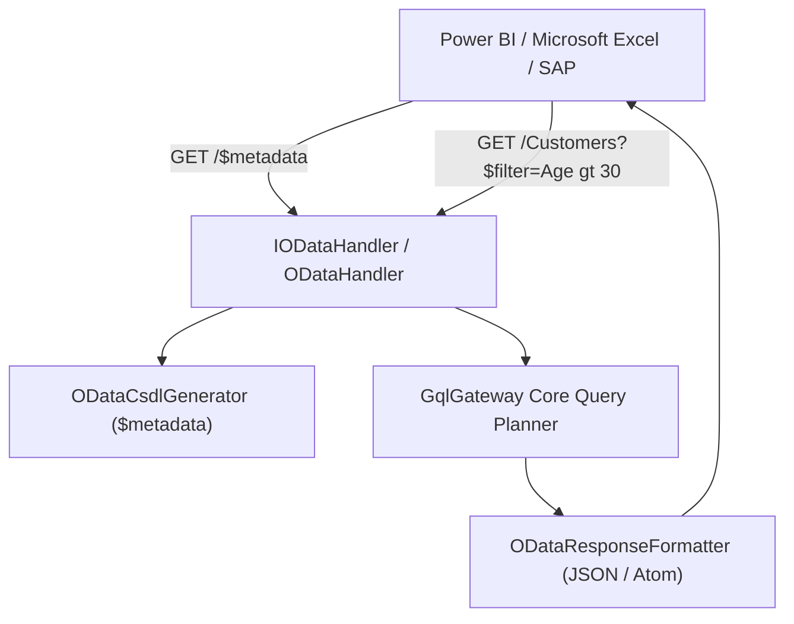

# OData v4 Data Source & Direct Connector Guide

Dieser Leitfaden beschreibt die Anbindung und das Serving von **OData v4** Datenquellen in `GqlGateway.Extensions`.

---

## 1. Übersicht & Zielgruppen

Während moderne Anwendungen GraphQL bevorzugen, nutzen BI- und ERP-Systeme wie **Power BI**, **Microsoft Excel** und **SAP Analytics Cloud** standardmäßig das OData v4-Protokoll.

Das Modul `OData` erfüllt zwei Aufgaben:
1. **OData als Upstream-Datenquelle**: Das Gateway kann entfernte SAP S/4HANA oder Microsoft Dynamics OData v4 Endpunkte als Subgraph / Datenquelle einbinden.
2. **OData v4 Exposure für Power BI**: Das Gateway kann vorhandene GraphQL-Datenquellen als CSDL (Common Schema Definition Language) Metadaten und OData v4 REST-Endpoints bereitstellen.

---

## 2. Komponenten-Architektur

- **[`IODataHandler`](file:///root/gql_extensions/src/GqlGateway.Extensions/OData/IODataHandler.cs) & [`ODataHandler`](file:///root/gql_extensions/src/GqlGateway.Extensions/OData/ODataHandler.cs)**: Verarbeitet eingehende OData v4 URL-Parameter (`$filter`, `$select`, `$top`, `$skip`, `$orderby`).
- **[`ODataCsdlGenerator`](file:///root/gql_extensions/src/GqlGateway.Extensions/OData/ODataCsdlGenerator.cs)**: Erzeugt dynamisch konforme EDMX / CSDL XML-Metadatendokumente aus dem internen Schema.
- **[`ODataResponseFormatter`](file:///root/gql_extensions/src/GqlGateway.Extensions/OData/ODataResponseFormatter.cs)**: Serialisiert Ergebnisse in standardkonformes OData v4 JSON mit `@odata.context` und `@odata.count`.

---

## 3. Query Pushdown & Paginierung

- **Filter Pushdown**: OData-Filterausdrücke (`eq`, `ne`, `gt`, `contains`) werden in SQL/AST Prädikate übersetzt und direkt an die Datenbank weitergereicht.
- **Keyset Paging**: Wenn möglich, werden `$top` und `$skip` in deterministisches Keyset-Paginieren umgewandelt, um Latenz-Spitzen bei großen Offsets zu vermeiden.
- **Sicherheits-Enforcement**: Sämtliche Tenant-Isolation- (`TenantId`) und Casbin-ABAC-Regeln greifen auch über den OData-Pfad identisch wie bei GraphQL-Queries.
